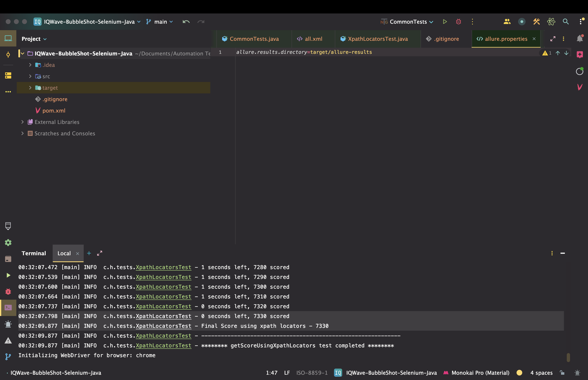

# IQWave BubbleShot Automation

Automation code written with **Selenium, Java and TestNG**, to automate the
[Bubble Shot](https://focus-check-lkm-001.web.app/) game.

Same test / code written, **leveraging both Xpath and CSS Selectors for comparison**.

Coincidentally while recording the demo, **scores were equal** using both of the strategies. On average, I have observed
**a score>=2500 with either of approach**.

Max score achieved till now is **7330**, using Xpath Locator strategy (screenshot attached).

Idea inspired by a [video](https://www.youtube.com/watch?v=2XZR-CXBFaA&ab_channel=LetCodewithKoushik) from
[LetCode with Koushik](https://www.youtube.com/@letcode).